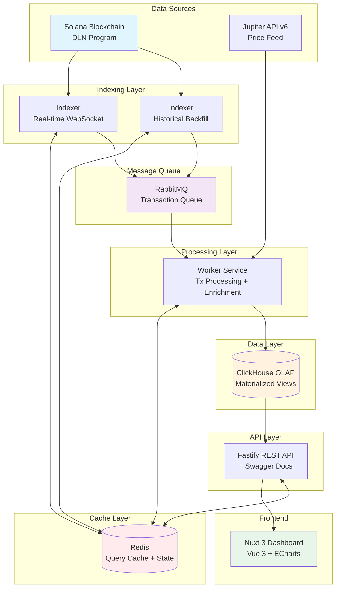

# DLN Volume Analytics Dashboard

> Real-time Solana DLN protocol transaction indexer with comprehensive analytics dashboard

[](https://www.typescriptlang.org/)
[](https://nodejs.org/)
[](LICENSE)

## Overview

A production-ready, high-performance transaction indexer for Solana's DLN (Debridge Liquidity Network) protocol. Features real-time monitoring, historical backfill capabilities, USD volume analytics, and a multi-language dashboard.

**Key Features:**
- 🔄 Real-time Solana transaction indexing via WebSocket
- 📊 Historical data backfill support
- 💰 Automated USD price enrichment via Jupiter API
- 📈 Pre-aggregated volume analytics with ClickHouse
- 🌍 Multi-language dashboard (English, Russian, German)
- 🚀 Production-ready with Docker & Kubernetes support
- ⚡ Redis caching for optimal performance
- 🔃 Auto-refreshing dashboard with TanStack Query polling (30s interval)

## Architecture



> 📖 For detailed architecture documentation, see [ARCHITECTURE.md](ARCHITECTURE.md)

## Quick Start

### Prerequisites

- Node.js >= 20.0.0
- pnpm >= 8.0.0
- Docker & Docker Compose (for infrastructure)
- Solana RPC endpoint (Helius, QuickNode, or Triton recommended)

### Development Setup

1. **Clone the repository**
   ```bash
   git clone <repository-url>
   cd incur-data
   ```

2. **Install dependencies**
   ```bash
   pnpm install
   ```

3. **Configure environment variables**
   ```bash
   cp .env.example .env
   ```
   Edit `.env` file and configure required variables (Solana RPC URL, database credentials, etc.)

4. **Start infrastructure services**
   ```bash
   docker-compose -f docker-compose.dev.yaml up -d
   ```

5. **Run database migrations**
   ```bash
   pnpm migrate:up
   ```

6. **Start development servers**
   ```bash
   pnpm dev
   ```

   **Alternative:** Start services individually
   ```bash
   # Terminal 1: Indexer (DLN Source Program)
   pnpm --filter @incur-data/indexer dev:src
   # Runs on port 8081, indexes src5qyZHqTqecJV4aY6Cb6zDZLMDzrDKKezs22MPHr4

   # Terminal 2: Indexer (DLN Destination Program)
   pnpm --filter @incur-data/indexer dev:dst
   # Runs on port 8082, indexes dst5MGcFPoBeREFAA5E3tU5ij8m5uVYwkzkSAbsLbNo

   # Terminal 3: Worker
   pnpm --filter @incur-data/worker dev

   # Terminal 4: API
   pnpm --filter @incur-data/api dev

   # Terminal 5: Web Dashboard
   pnpm --filter @incur-data/web dev
   ```

7. **Access the dashboard**
   - Dashboard: http://localhost:3000
   - API Docs: http://localhost:3001/docs
   - API Health: http://localhost:3001/health

### Docker Compose (Production)

```bash
# Start all services
docker-compose up -d

# View logs
docker-compose logs -f

# Stop services
docker-compose down
```

## Tech Stack

**Backend:**
- [Node.js](https://nodejs.org/) - Runtime environment
- [TypeScript](https://www.typescriptlang.org/) - Type safety
- [Fastify](https://www.fastify.io/) - High-performance web framework
- [Pino](https://getpino.io/) - Structured logging

**Database & Cache:**
- [ClickHouse](https://clickhouse.com/) - OLAP database with materialized views
- [Redis](https://redis.io/) - Caching and state management
- [RabbitMQ](https://www.rabbitmq.com/) - Message queue

**Frontend:**
- [Nuxt 3](https://nuxt.com/) - Vue.js framework
- [Vue 3](https://vuejs.org/) - Composition API
- [TanStack Query](https://tanstack.com/query) - Data fetching with automatic polling
- [Tailwind CSS](https://tailwindcss.com/) - Utility-first CSS
- [ECharts](https://echarts.apache.org/) - Data visualization
- [vue-i18n](https://vue-i18n.intlify.dev/) - Internationalization

**Build Tools:**
- [Turborepo](https://turbo.build/) - Monorepo build system
- [pnpm](https://pnpm.io/) - Fast, disk space efficient package manager

**Blockchain:**
- [@solana/web3.js](https://solana-labs.github.io/solana-web3.js/) - Solana SDK
- [Jupiter API](https://station.jup.ag/docs/apis/swap-api) - Token pricing

## Project Structure

```
incur-data/
├── apps/
│   ├── api/                 # Fastify REST API with Swagger
│   ├── indexer/             # Solana transaction discovery (2 instances: src & dst programs)
│   ├── worker/              # Transaction processing pipeline
│   └── web/                 # Nuxt 3 analytics dashboard
├── packages/
│   ├── config/              # Shared configuration
│   ├── dtos/                # TypeScript DTOs with Zod validation
│   ├── olap-types/          # ClickHouse schema types
│   ├── rabbitmq/            # Message queue utilities
│   ├── tx-parsing/          # Solana transaction parser
│   └── ui/                  # Reusable Vue components
├── migrations/              # ClickHouse SQL migrations
├── k8s/                     # Kubernetes manifests
├── docker-compose.yml       # Development environment
└── docker-compose.prod.yml  # Production environment
```

## API Endpoints

### Volume Analytics

- `GET /api/v1/analytics/daily-volume` - Daily volume by event type
- `GET /api/v1/analytics/daily-volume-summary` - Created vs fulfilled summary
- `GET /api/v1/analytics/stats` - Aggregated statistics
- `GET /api/v1/analytics/comparison` - Volume comparison
- `GET /api/v1/analytics/timeseries` - Time series for charts
- `GET /api/v1/analytics/top-tokens` - Top token pairs by volume
- `GET /api/v1/analytics/by-chain` - Volume distribution by chain

### System

- `GET /health` - Health check endpoint
- `POST /api/v1/volume/invalidate-cache` - Admin cache invalidation (requires auth)

**Query Parameters:**
- `from_date` - Start date (YYYY-MM-DD)
- `to_date` - End date (YYYY-MM-DD)
- `event_type` - Filter by `created` or `fulfilled`
- `program_id` - Filter by program ID
- `give_chain_id` - Source chain filter
- `take_chain_id` - Destination chain filter
- `limit` - Result limit (default: 100, max: 1000)

## Configuration

### Environment Variables

**API Service:**
```bash
API_PORT=3001
API_HOST=0.0.0.0
API_CORS_ORIGIN=http://localhost:3000  # Comma-separated for multiple
API_ADMIN_KEY=<32+ character secret>    # For admin endpoints
API_AUTH_ENABLED=true
```

**Indexer Service:**
```bash
SOLANA_RPC_URL=https://api.mainnet-beta.solana.com
PROGRAM_ID=<DLN program public key>
START_SLOT=<starting slot for backfill>
```

**Database:**
```bash
CLICKHOUSE_URL=http://localhost:8123
CLICKHOUSE_DATABASE=dln
REDIS_URL=redis://localhost:6379
RABBITMQ_URL=amqp://localhost:5672
```

See `.env.example` for complete configuration.

## Development

### Build

```bash
# Build all packages
pnpm run build

# Build specific package
pnpm --filter @incur-data/api build
```

### Database Migrations

```bash
# Start dev (with automatic migrations)
pnpm dev

# Start dev without migrations
pnpm dev:no-migrate

# Check migration status
pnpm migrate:status

# Apply pending migrations
pnpm migrate:up

# Initialize database with migrations
pnpm migrate:init --auto

# Show database statistics
pnpm migrate:stats

# Verify database integrity
pnpm migrate:verify
```

> **Note:** `pnpm dev` automatically runs pending migrations before starting dev servers.
> See [MIGRATION_SETUP.md](MIGRATION_SETUP.md) for detailed migration documentation.

### Testing

```bash
# Run all tests
pnpm test

# Run tests with coverage
pnpm test:coverage

# Type checking
pnpm typecheck
```

### Code Quality

```bash
# Lint
pnpm lint

# Format
pnpm format

# Type check
pnpm typecheck
```

## Deployment

### Docker

```bash
# Production build
docker-compose -f docker-compose.prod.yml up -d

# Scale workers
docker-compose -f docker-compose.prod.yml up -d --scale worker=3
```

### Kubernetes

```bash
# Apply manifests
kubectl apply -f k8s/namespace.yaml
kubectl apply -f k8s/

# Check deployment
kubectl get pods -n incur-data
kubectl logs -f deployment/api -n incur-data
```

## Monitoring

- **Metrics**: Prometheus metrics exposed on port 9090
- **Logs**: Structured JSON logs via Pino
- **Health Checks**: `/health` endpoint checks ClickHouse, Redis, RabbitMQ
- **Tracing**: Request ID tracking across services

## Security

- ✅ API key authentication for admin endpoints
- ✅ CORS configured with specific origins (no wildcards in production)
- ✅ Request sanitization to prevent log injection
- ✅ Rate limiting (100 req/min default)
- ✅ Input validation via Zod schemas
- ✅ Parameterized ClickHouse queries (SQL injection prevention)

## Performance

- **API Response Time**: <200ms (p95) with Redis caching
- **Worker Throughput**: 100+ transactions/second
- **Cache Hit Rate**: 80%+ for volume queries
- **Database**: Materialized views for instant aggregation queries

## Real-time Dashboard Updates

The dashboard uses TanStack Query for automatic data polling:

- **Polling Interval**: 30 seconds for all analytics endpoints
- **Background Updates**: Data refreshes even when browser tab is inactive
- **Polled Endpoints**:
   - `/api/v1/analytics/daily-volume-summary` - Volume chart data
   - `/api/v1/analytics/total-stats` - Stats cards (total volume, orders, etc.)

Configuration in `apps/web/pages/index.vue`:
```typescript
const POLLING_INTERVAL = 30 * 1000; // 30 seconds

const volumeData = useDailyVolumeSummary(filters, {
   refetchInterval: POLLING_INTERVAL,
   refetchIntervalInBackground: true
});
```

## Contributing

See [CONTRIBUTING.md](CONTRIBUTING.md) for development guidelines.

## License

MIT License - see [LICENSE](LICENSE) file for details.

## Support

- 📧 Issues: [GitHub Issues](https://github.com/your-org/incur-data/issues)
- 📖 Documentation: See `/docs` directory
- 💬 Discord: [Join our community](#)

---

**Built with ❤️ by the Debridge team**
